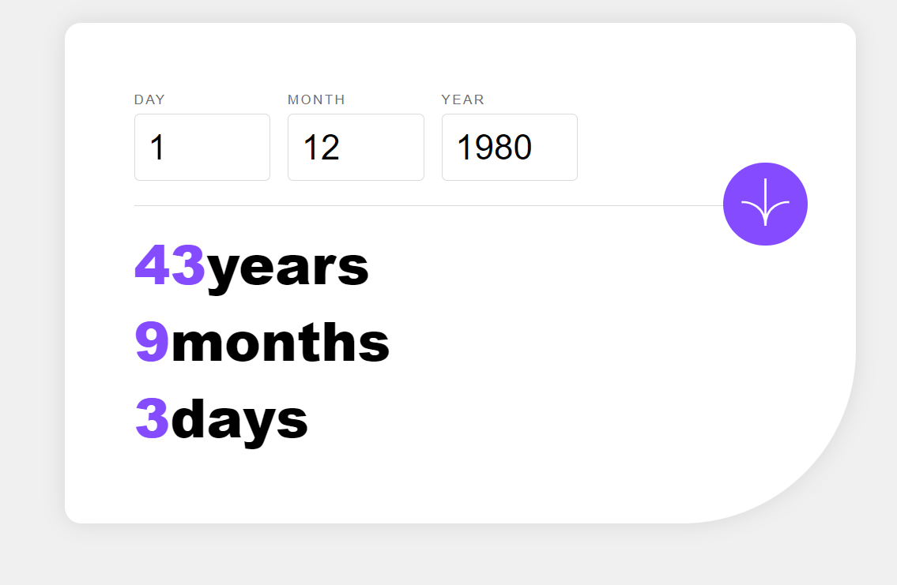
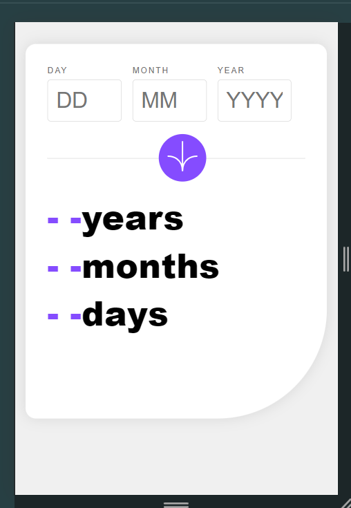

# Age calculator app solution

## Table of contents

- [Overview](#overview)
  - [The challenge](#the-challenge)
  - [Screenshot](#screenshot)
  - [Links](#links)
- [My process](#my-process)
  - [Built with](#built-with)
  - [What I learned](#what-i-learned)
  - [Useful resources](#useful-resources)
- [Author](#author)

## Overview

### The challenge

Users should be able to:

- View an age in years, months, and days after submitting a valid date through the form
- Receive validation errors if:
  - Any field is empty when the form is submitted
  - The day number is not between 1-31
  - The month number is not between 1-12
  - The year is in the future
  - The date is invalid e.g. 31/04/1991 (there are 30 days in April)
- View the optimal layout for the interface depending on their device's screen size
- See hover and focus states for all interactive elements on the page
- **Bonus**: See the age numbers animate to their final number when the form is submitted

### Screenshot

**Desktop Preview**


**Active States**



**Mobile Preview**



### Links

- Solution URL: [Add solution URL here](https://your-solution-url.com)
- Live Site URL: [Add live site URL here](https://your-live-site-url.com)

## My process

### Built with

- Semantic HTML5 markup
- CSS custom properties
- Flexbox
- CSS Grid
- Mobile-first workflow
- Vanilla Javascript
- Google Fonts

### What I learned

Working on a project like an age calculator app involves various aspects of web development, from HTML and CSS to JavaScript and responsive design. Here’s what I have learned while working on this project:

### HTML Structure and Form Handling
Form Elements: How to structure and use form elements effectively 
```html
<input>, <label>, <button>
``` 
to capture user input.
Validation: Using HTML attributes like required, min, and max for basic form validation, and how to handle errors in a user-friendly way.
 ### CSS Styling and Layout
- Responsive Design: Techniques for making a design adapt to different screen sizes using media queries. This includes adjusting layout, font sizes, and button sizes based on screen width.
- Flexbox and Grid: Utilizing Flexbox for layout and alignment, and CSS Grid for organizing content. Understanding how these layout systems work and when to use them.
- Custom Properties: Using CSS variables (custom properties) for easier theme management and color consistency.
- Styling Forms: Enhancing form elements with custom styles, including focus states, error messages, and hover effects.
### JavaScript for Interactivity
- Event Handling: Adding event listeners to handle form submissions and user interactions.
- Validation Logic: Implementing custom validation logic to handle more complex scenarios (e.g., date validation and error messages).
- Date Calculations: Calculating differences between dates and handling date-related logic.
- Animations: Creating smooth animations to enhance user experience, such as animating the display of age values.
### Error Handling and User Feedback
- Displaying Errors: Providing clear and actionable error messages to guide users when they make mistakes.
- Dynamic Updates: Updating the UI dynamically based on user input and calculations.
### Performance and Optimization
- Efficient DOM Manipulation: Using JavaScript to update the DOM efficiently and avoid unnecessary reflows or repaints.
- Responsive Performance: Ensuring that the application performs well across different devices and screen sizes.
### Best Practices and Code Organization
- Separation of Concerns: Keeping HTML, CSS, and JavaScript in separate files for better organization and maintainability.
- Code Reusability: Writing reusable functions and components to avoid redundancy and make the codebase more manageable.
### User Experience (UX)
- Design Considerations: Understanding the importance of a clean, user-friendly design that enhances the overall user experience.
- Accessibility: Ensuring that interactive elements are accessible and that error messages are clearly communicated.


### Useful resources

- [ resource 1](https://developer.mozilla.org/en-US/)
- [ resource 2](https://stackoverflow.com/) 
- [ resource 3](https://openai.com/chatgpt/)

## Author
- Frontend Mentor - [@mushamak](https://www.frontendmentor.io/profile/mushamak)
